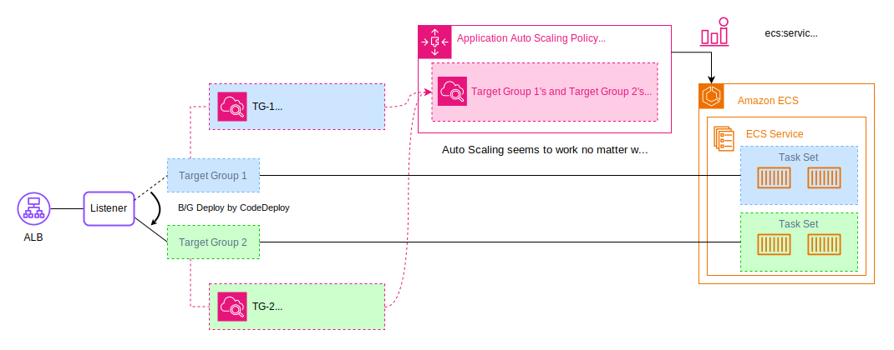
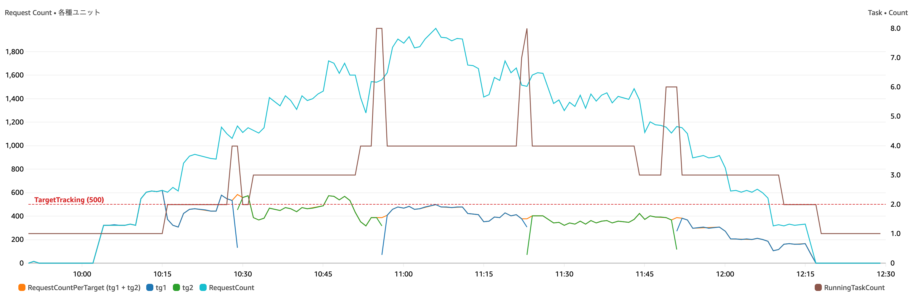
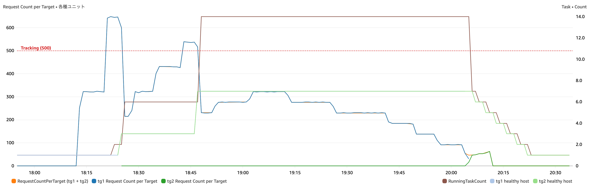

# Demo : ECS Target Tracking Auto Scaling with Metric Math Under CodeDeploy Blue/Green Deployment

[日本語の情報(for Japanese)](https://blog.msysh.me/posts/2024/03/ecs-blue-green-deploy-with-request-count-per-target-tracking-autoscaling-with-metric-math.html)

This is a demo application that ECS target track auto scaling by Request Count per Target with Metric Math under CodeDeploy Blue/Green Deployment.

## Background

CodeDeploy has capability Blue/Green deployment for Amazon ECS and ECS has capability Auto Scaling its tasks with Request Count per Target Group.
However, the two capabilities are incompatible at the same time.
Because, the auto scaling policy can only refer to one target group.
In that case, you can configure that swapping the reference of the policy to another target group using CodeDeploy Lifecycle Event Hook Lambda.
However, this demo app is an attempt to use target tracking autoscaling by request count per target in CodeDeploy Blue/Green deploy without using Lifecycle Event Hook Lambda, using Metric Math, instead of that way.



## How to deploy

All resources for this project are provisioned by the AWS Cloud Development Kit (CDK).
If you have not installed the CDK, first install it by referring to [this document](https://docs.aws.amazon.com/cdk/v2/guide/getting_started.html).

### 1. Clone this project

```bash
git clone https://github.com/msysh/aws-demo-ecs-metric-math-auto-scaling-with-bg-deploy.git
```

### 2. Deploy AWS resources by CDK

```bash
cd aws-demo-ecs-metric-math-auto-scaling-with-bg-deploy
cdk deploy
```

After completion deployment, you can get following values and so on.
Please note them.

* CodeCommit repository URL (SSH or GRC) (`PipelineOutputCodeCommitRepositoryUrl`)
* ECS Cluster name (`WorkloadOutputEcsClusterName`)
* ECS Service name (`WorkloadOutputEcsServiceName`. If not change, it's `target-tracking-auto-scaling`)
* Web App URL for production(:80) (`WorkloadOutputAlbProdDns`)
* ECS Task Role arn (`WorkloadOutputRoleTask`)
* ECS Task Execution Role arn (`WorkloadOutputRoleTaskExecution`)

### 3. Set up a demo CodeCommit repository

[assets/demo-app-repository](./assets/demo-app-repository/) is git repository for demo.
Set up it as git repository.

```bash
cd ./assets/demo-app-repository/
git init
git remote add origin ${CodeCommitRepositoryUrl} -m main
```

_`${CodeCommitRepositoryUrl}` is able to get from CDK Output._

### 4. Configure Task Role and Task Execution Role in the ECS Task Definition

[assets/demo-app-repository/taskdef.json](./assets/demo-app-repository/taskdef.json) is an ECS Task Definition file.
Please set task role arn and task execution role arn in the file.

```json
{
  // :
  "taskRoleArn": "<<Please set task role arn which you got from cdk output>>",
  "executionRoleArn": "<<Please set task EXECUTION role arn which you got from cdk output>>",
  // :
}
```

_Each role arn is able to get from CDK Output._

## How to play as demonstration

### 1. Push demo app for first commit

```bash
cd assets/demo-app-repository/
git status
git add .
git commit -m "first commit"
git push origin main
```

If you can not push to repository, please check the [documentation](https://docs.aws.amazon.com/codecommit/latest/userguide/setting-up.html).

### 2. Pipeline is triggered

Push commit to the repository, then the pipeline is triggered.
There are some stages that 1)Build app, 2)Build image, and 3)B/G Deploy.

### 3. Load to Encourage Auto Scaling

Load to encourage ECS task auto scaling. You can use a sample script at [./assets/load-sample/load-test.sh](./assets/load-sample/load-test.sh)

At first you need to set a demo app URL in the script file.

```sh
# Please set a demo app URL which you can get CDK Output.
URL="http://xxxxx.xxxxx.elb.amazonaws.com/"
```

_The URL is able to get from CDK Output._

### 4. Deploy new revision

Please try B/G deploy while under load.
Update a file in the repository, push it, and the pipeline will be triggered.
You can perform following for example.

```bash
cd assets/demo-app-repository/
sed -i s/background-color:\ \#99f/background-color:\ \#9f9/ index.html

# If you use MacOS, following command
# sed -i '' s/background-color:\ \#99f/background-color:\ \#9f9/ index.html
```
_Change background color from blue to green._

And commit changes and push.

```bash
git add .
git commit -m "change background color"
git push origin main
```

### 5. Blue / Green Deployment

Login to the AWS Management Console, open Amazon ECS (Blue/Green) from the "Deploy" stage of CodePipeline and reroute traffic to execute B/G deploy.

### 6. Check Auto Scaling Behavior

Please check that auto scaling is working without problems even while loading.

## Result Sample

Attached are the metrics from running this demo app for reference.



The following are the results of continuous load without "Traffic Rerouting", with scale-out triggered in the Green environment as well as in the Blue environment. On the other hand, scale-in is not triggered until completion the "Traffic Rerouting", even if the load is reduced.



## Clean up

Some resources in this project will be charged by time, so if you no longer need them, please remove them.

Remove resources by CDK.

```bash
cdk destroy
```

However, due to the Blue/Green swap, the association with the ALB listener may have drifted since the CDK was deployed. If this is the case, delete the resource manually.

And following resources:

* **ECR repository**. Repository Uri is able to get as `WorkloadOutputEcrRepositoryUri` from CDK Output.
* **S3 bucket for artifacts**. S3 Bucket Name is able to get as `PipelineOutputArtifactBucketName` from CDK Output.

## License

MIT
